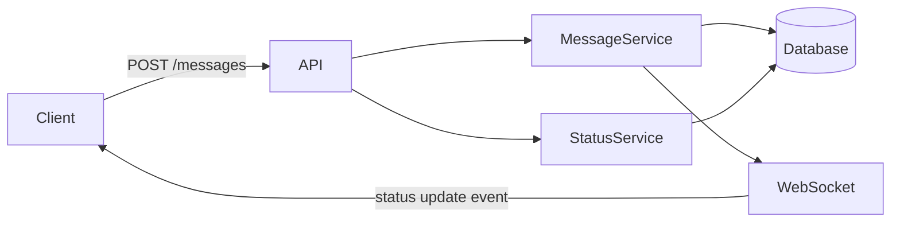
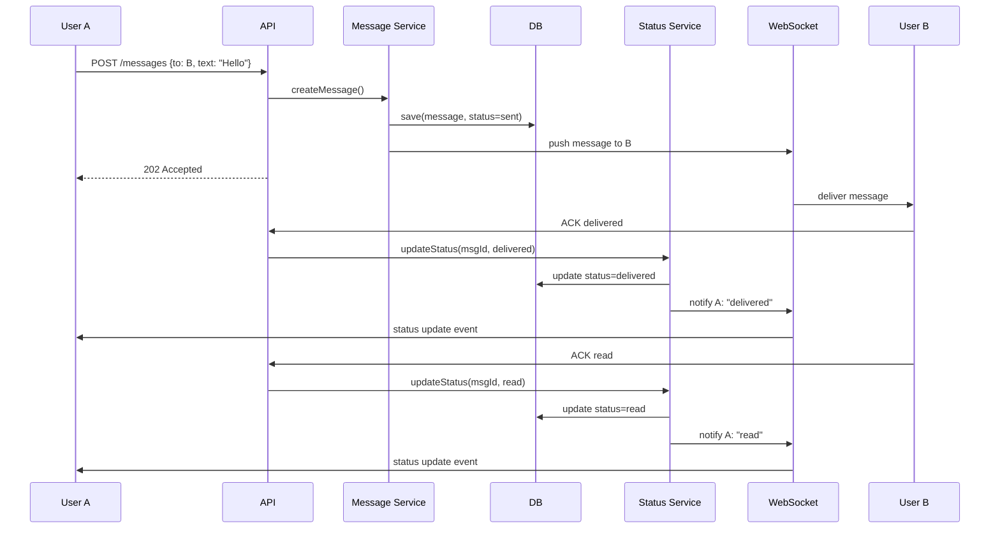
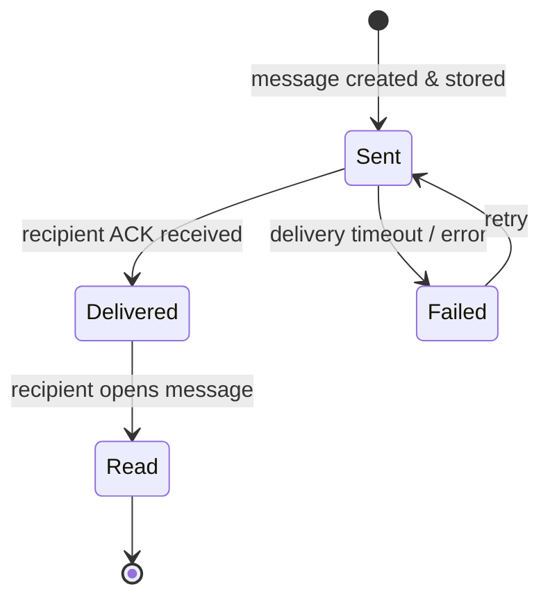

# Laboratory Work 1 — Variant 2: Message Status Tracking

**Student:** _(your name)_  
**Variant:** 2 — Message Status Tracking  
**Focus:** State machine and lifecycle of message statuses

---

## 🧩 Part 1 — Component Diagram

The system consists of the following components:

- **Client (Web / Mobile)** — sends messages and receives real-time status updates via WebSocket.
- **Backend API** — handles incoming HTTP requests and routes them to the appropriate services.
- **Message Service** — responsible for creating, storing, and initiating delivery of messages.
- **Status Service** — tracks and updates message statuses based on client acknowledgements.
- **Database** — persists messages and their current status.
- **WebSocket / Push** — delivers real-time events (status changes) back to clients.



---

## 🔁 Part 2 — Sequence Diagram

**Scenario:** User A sends a message to User B, who is online. The system tracks delivery and read acknowledgements.



---

## 🔄 Part 3 — State Diagram

**Object:** `Message`

The message goes through the following lifecycle states:



**State descriptions:**

| State | Description |
|---|---|
| `Sent` | Message saved in DB, delivery attempted |
| `Delivered` | Client acknowledged receipt |
| `Failed` | No ACK within timeout window |
| `Read` | User opened / viewed the message |

---

## 📚 Part 4 — ADR-001: Client Acknowledgement Strategy

```markdown
# ADR-001: Use Explicit Client Acknowledgements for Status Updates

## Status
Accepted

## Context
The system needs to reliably track whether a message was delivered to and
read by the recipient. The server cannot know this on its own — it depends
on the client confirming receipt.

## Decision
The client sends two explicit ACK events to the API:
1. `ACK delivered` — sent automatically when the message arrives in the app.
2. `ACK read` — sent when the user opens the conversation containing the message.

The Status Service processes these events and updates the message state in the database.
The sender is notified in real time via WebSocket.

## Alternatives
- **Polling** — client asks the server "what's the status?" periodically.
  Rejected: wasteful, increases latency and server load.
- **Server-side inference** — server marks "delivered" when WebSocket push succeeds.
  Rejected: a push reaching the socket does not guarantee the app received it
  (e.g., background tab, crash). ACKs are more accurate.

## Consequences
+ Accurate delivery and read status tracking
+ Sender gets real-time feedback
- If the client is offline when ACK should be sent, the status update is delayed
- Requires retry logic for missed ACKs (e.g., send ACK on next app open)
```

---

## Summary

This design focuses on the **lifecycle of a message** and the mechanism by which statuses are updated. The key architectural decision is using **explicit client ACKs** rather than server-side inference, which gives accurate and reliable status tracking at the cost of some added complexity in the client implementation.
