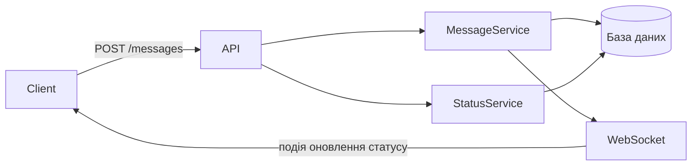
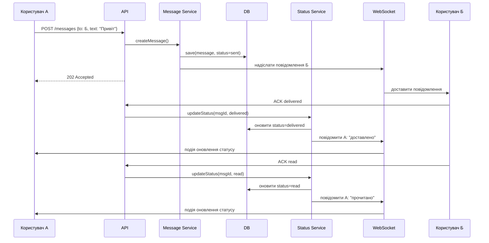
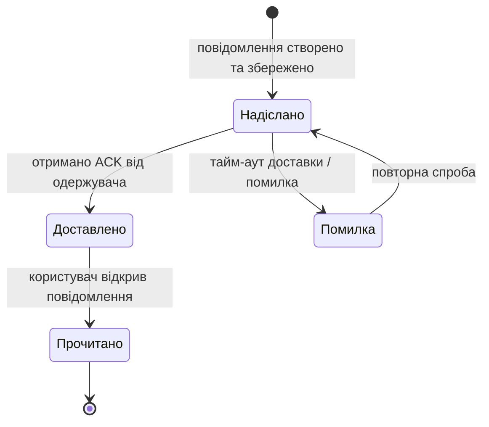

# Лабораторна робота №1 — Варіант 2: Відстеження статусів повідомлень

**Студент:** _(ваше ім'я)_  
**Варіант:** 2 — Відстеження статусів повідомлень  
**Фокус:** Стан-машина та життєвий цикл статусів повідомлення

---

## 🧩 Частина 1 — Діаграма компонентів

Система складається з таких компонентів:

- **Client (Web / Mobile)** — надсилає повідомлення та отримує оновлення статусів у реальному часі через WebSocket.
- **Backend API** — обробляє вхідні HTTP-запити та маршрутизує їх до відповідних сервісів.
- **Message Service** — відповідає за створення, збереження та доставку повідомлень.
- **Status Service** — відстежує та оновлює статуси повідомлень на основі підтверджень від клієнта.
- **Database** — зберігає повідомлення та їхні поточні статуси.
- **WebSocket / Push** — доставляє події в реальному часі (зміни статусів) назад клієнтам.



---

## 🔁 Частина 2 — Діаграма послідовності

**Сценарій:** Користувач А надсилає повідомлення користувачу Б, який онлайн. Система відстежує підтвердження доставки та прочитання.



---

## 🔄 Частина 3 — Діаграма станів

**Об'єкт:** `Message` (Повідомлення)

Повідомлення проходить через такі стани:



**Опис станів:**

| Стан | Опис |
|---|---|
| `Надіслано` | Повідомлення збережено в БД, спроба доставки здійснена |
| `Доставлено` | Клієнт підтвердив отримання (ACK delivered) |
| `Помилка` | Не отримано ACK протягом часу очікування |
| `Прочитано` | Користувач відкрив / переглянув повідомлення |

---

## 📚 Частина 4 — ADR-001: Стратегія підтвердження від клієнта

```markdown
# ADR-001: Використання явних підтверджень від клієнта для оновлення статусів

## Статус
Прийнято

## Контекст
Система має надійно відстежувати, чи було повідомлення доставлено та прочитано
одержувачем. Сервер не може визначити це самостійно — він залежить від підтверджень
з боку клієнта.

## Рішення
Клієнт надсилає два явні ACK-події до API:
1. `ACK delivered` — надсилається автоматично, коли повідомлення надходить у застосунок.
2. `ACK read` — надсилається, коли користувач відкриває чат із цим повідомленням.

Status Service обробляє ці події та оновлює стан повідомлення в базі даних.
Відправник отримує сповіщення в реальному часі через WebSocket.

## Альтернативи
- **Polling (опитування)** — клієнт periodically запитує сервер про статус.
  Відхилено: надмірне навантаження, висока затримка.
- **Серверна інференція** — сервер вважає повідомлення "доставленим", якщо
  WebSocket-пуш пройшов успішно.
  Відхилено: успішний пуш не гарантує, що застосунок прийняв повідомлення
  (наприклад, фонова вкладка, збій). ACK точніший.

## Наслідки
+ Точне відстеження статусів "доставлено" та "прочитано"
+ Відправник бачить зворотній зв'язок у реальному часі
- Якщо клієнт офлайн під час ACK, оновлення статусу затримується
- Потрібна логіка повторних спроб для пропущених ACK
```

---

## Висновок

Цей проєкт зосереджений на **життєвому циклі повідомлення** та механізмі оновлення статусів. Ключове архітектурне рішення — використання **явних ACK від клієнта** замість серверної інференції, що забезпечує точне та надійне відстеження статусів ціною додаткової складності на стороні клієнта.
